# Network-Traffic-Threat-Hunting
## Part 1: Normal Network Baseline (macOS Idle State)

Before hunting for anomalous or malicious activity, it is critical to establish a baseline of a healthy network. A packet capture was performed on a macOS device in an idle state (all user applications closed) on the local Wi-Fi interface (en0). 

The following standard background activities were identified:

* **Encrypted Background Services (DNS & QUIC):** Even in an idle state, the system actively communicates with Google and Apple services. DNS queries to `calendar.google.com`, `help.apple.com`, and `cds.apple.com` were observed.
  
  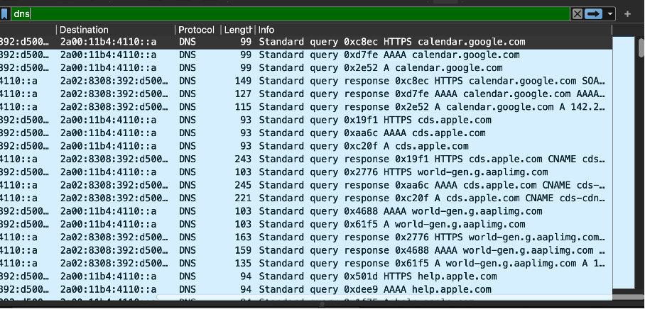

  The system calendar synchronizes data using the QUIC protocol, which is a modern, faster replacement for traditional TCP+TLS.
  
  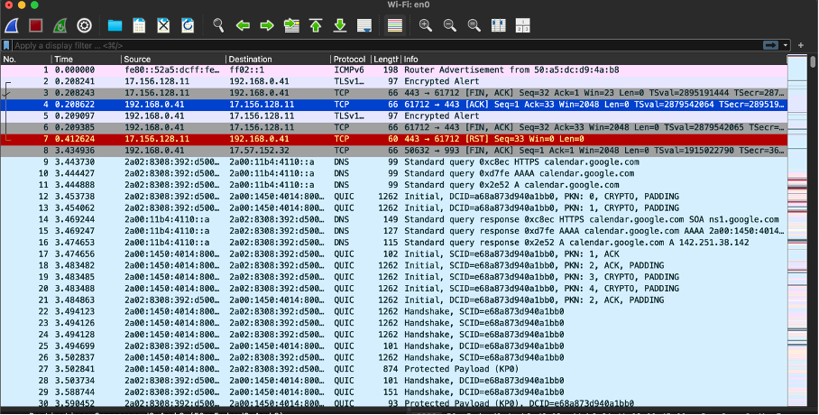

* **Time Synchronization (NTP):** Regular automated communication on UDP port 123 was captured. The system utilizes NTP Version 4 (Network Time Protocol) to continuously verify and synchronize accurate time against internet servers.

  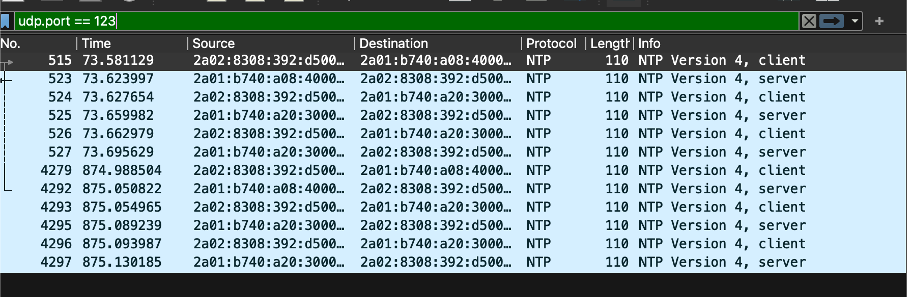

* **Local Network Maintenance (ARP & ICMP):** The local TP-Link router actively maintains network state. It utilizes ARP broadcasts to resolve the MAC addresses of connected devices. Additionally, the router sends ICMP Echo (ping) requests to the host machine, which immediately responds with Echo replies, verifying device availability. The capture also recorded minor packet loss resulting in standard TCP Retransmissions.

  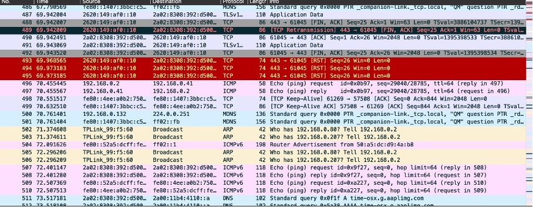

* **Apple Ecosystem Discovery (mDNS) & Unsuccessful Handshakes (TCP RST):** Multicast DNS traffic querying the `_companion-link._tcp.local` service was frequent. This is expected behavior within the Apple ecosystem, facilitating connection features like Continuity, Handoff, and Universal Control between Mac and iOS devices. 
  
  Simultaneously, a significant volume of TCP packets flagged with `[RST, ACK]` was recorded between local IP addresses. In a baseline state, this occurs when one device attempts a connection on a specific port to verify service availability, but the target device actively refuses (resets) it because the requested service is currently inactive or asleep.

  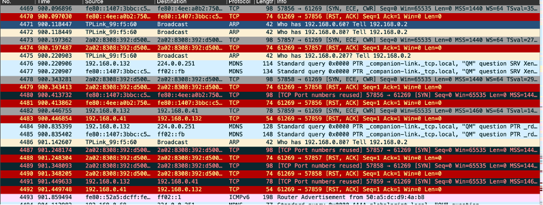

## Part 2: Threat Detection & Incident Analysis (RedLine Stealer Infection)

**Incident Overview:**
This section analyzes a packet capture (PCAP) containing a real-world malware infection. 
* **Date of Incident:** July 10, 2023 (approx. 22:39 UTC)
* **Objective:** The objective of this Threat Hunting exercise was to identify the victim, trace the initial access vector (staging), uncover defense evasion techniques, and locate the Command & Control (C2) server used for data exfiltration by the RedLine Stealer malware.
  
### Phase 1: Victim Identification
The investigation began by identifying the compromised host within the local network. By filtering for DHCP traffic (`bootp`), the initial IP lease request and acknowledgment were analyzed.
* **Findings:** The victim's machine requested and was assigned the IP address `10.7.10.47`. The DHCP Request packet revealed the victim's Host Name as `DESKTOP-9PEA63H`.

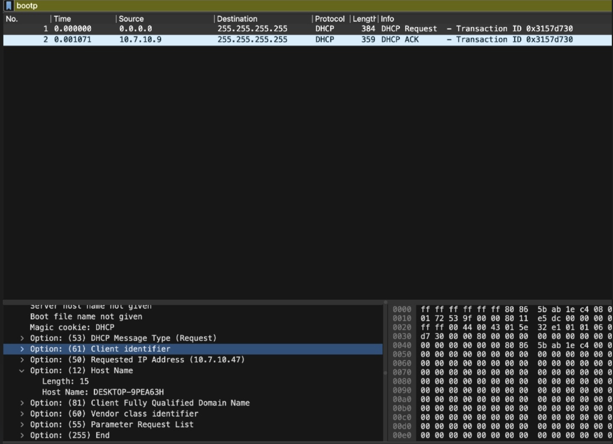
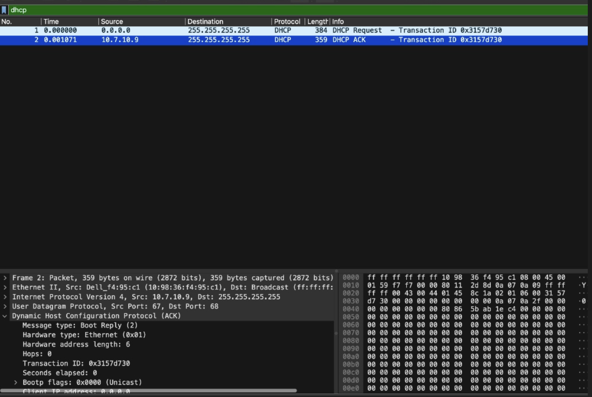

### Phase 2: Initial Access & Reconnaissance (Staging)
To find the infection vector, HTTP traffic was filtered (`http.request.method == "GET"`). Suspicious outbound connections from the victim's IP were identified, revealing automated scripts rather than legitimate user browsing.
* **Findings:** Two HTTP GET requests were sent to `195.161.114.3` (domain: `623start.site`). The URI parameters `/?status=start&av=Windows%20Defender` and `/?status=install` indicate that a malicious script was reporting the host's antivirus status to the attacker and signaling readiness for the next stage.
* **Anomaly Detected:** The HTTP headers for these requests exposed `User-Agent: WindowsPowerShell`. Command-line tools downloading files without user interaction are a critical indicator of compromise. 
Legitimate user web browsing generates extensive traffic with standard browser User-Agents. The presence of isolated HTTP requests generated by Windows PowerShell containing system status parameters in the URI is a clear indicator of automated malicious reconnaissance (Living off the Land technique).

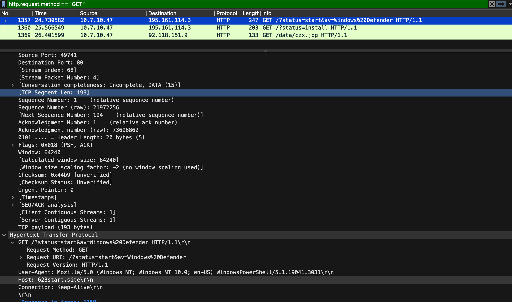
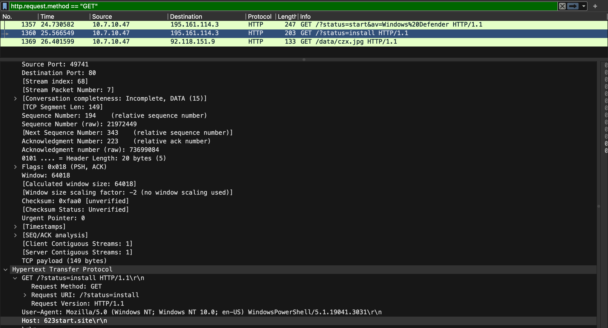

### Phase 3: Payload Delivery & Defense Evasion
Shortly after the reconnaissance phase, the script initiated the download of the primary malicious payload.
* **Findings:** The victim's machine requested a file named `czx.jpg` from `92.118.151.9` (domain: `guiatelefonos.com`). 
* **Anomalies Detected:** 
  1. **Missing User-Agent:** The HTTP GET request completely lacked a User-Agent header, proving the request was generated by a rudimentary, non-standard script.
  2. **File Masking & Redirect:** Analysis of the TCP stream revealed an `HTTP 301 Moved Permanently` response. The server actively redirected the unencrypted download request to a secure HTTPS connection (port 443). This is a known defense evasion technique intended to hide the malicious file's Magic Bytes (e.g., `MZ` for executables) from deep packet inspection and network intrusion detection systems.

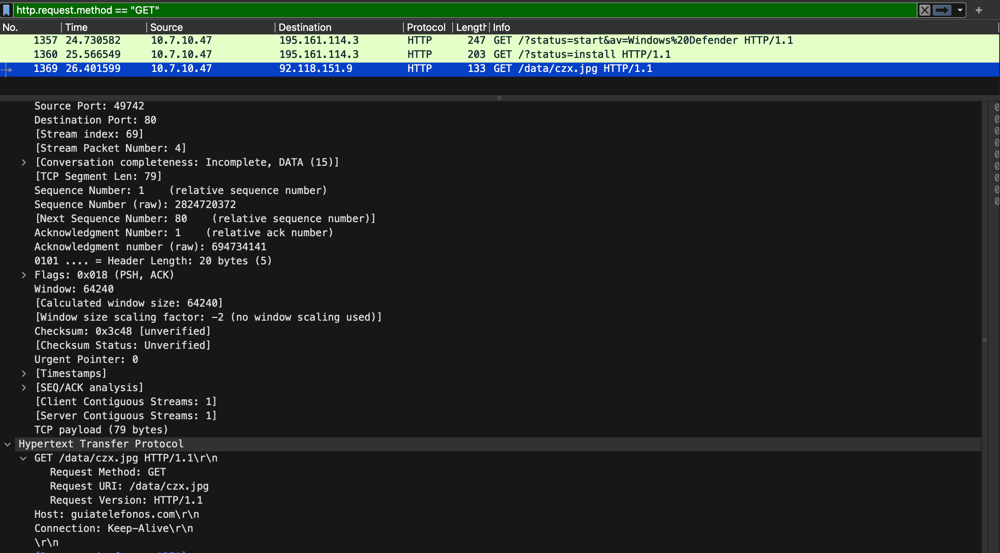
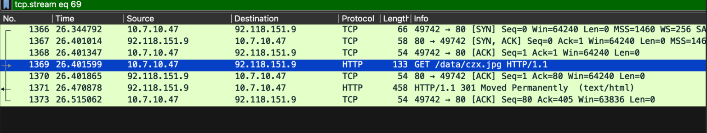
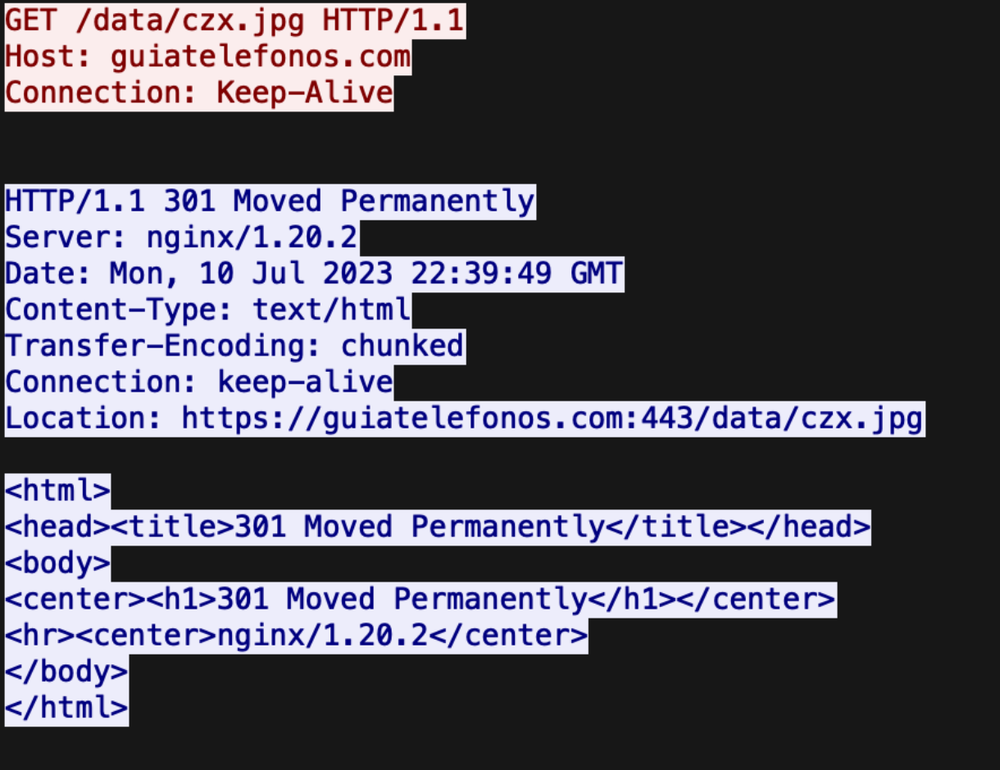

### Phase 4: Command & Control (C2) Exfiltration
Because RedLine Stealer often uses custom communication protocols instead of standard web forms, the analysis shifted to monitoring new, outbound TCP handshakes initiated by the victim (`ip.src == 10.7.10.47 and tcp.flags.syn == 1 and tcp.flags.ack == 0`).
* **Findings:** Following the payload execution, the infected machine established a new connection to a completely unknown IP address `194.26.135.119`.
* **Anomaly Detected:** The communication was directed to Destination Port `12432`. Legitimate web traffic typically uses ports 80 or 443. The use of a high, non-standard port is highly characteristic of malware establishing an encrypted C2 channel to exfiltrate stolen credentials and browser data.

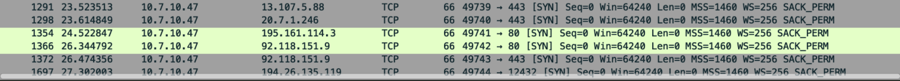

---

### Indicators of Compromise (IOCs)

| Type | Value | Description |
| :--- | :--- | :--- |
| **Timestamp** | `2023-07-10 22:39:49 UTC` | Time of the payload delivery redirect |
| **Victim IP** | `10.7.10.47` | Infected local host |
| **Victim Hostname** | `DESKTOP-9PEA63H` | Identified via DHCP traffic |
| **Attacker IP** | `195.161.114.3` | Staging server (PowerShell script execution) |
| **Attacker Domain** | `623start.site` | Staging / Reconnaissance domain |
| **Attacker IP** | `92.118.151.9` | Payload delivery server |
| **Attacker Domain** | `guiatelefonos.com` | Compromised domain hosting malware |
| **File Path** | `/data/czx.jpg` | Executable payload disguised as an image |
| **C2 IP Address** | `194.26.135.119` | Command & Control data exfiltration server |
| **Suspicious Port**| `12432` | Non-standard port used for C2 communication |

### Security Recommendations & Mitigation

Based on the analysis of this RedLine Stealer infection, the following security measures are recommended to prevent similar incidents:

* **Egress Port Filtering:** The malware exfiltrated data over a non-standard port (`12432`). Firewalls should be configured to block outbound traffic on non-standard ports, strictly allowing only necessary business ports (e.g., 80, 443, 53).
* **Restrict PowerShell Execution:** The initial staging was executed via `WindowsPowerShell` communicating directly with an external server. Implement strict PowerShell Execution Policies and monitor for unusual PowerShell commands (e.g., downloading external payloads) via an Endpoint Detection and Response (EDR) solution.
* **Block Malicious Indicators:** Immediately blacklist the identified IPs (`195.161.114.3`, `92.118.151.9`, `194.26.135.119`) and domains (`623start.site`, `guiatelefonos.com`) on the corporate firewall and DNS filters.
* **Network-Level File Inspection:** The primary payload bypassed basic filters by masquerading as a `.jpg` file. Implement Deep Packet Inspection (DPI) or an Intrusion Prevention System (IPS) capable of analyzing file signatures (Magic Bytes) rather than relying solely on file extensions.
